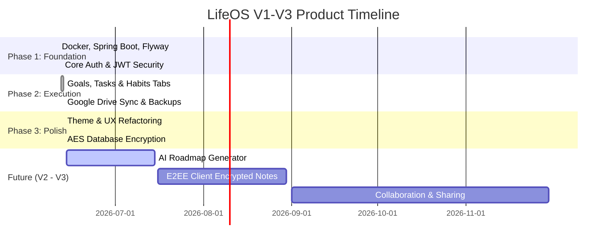

# LifeOS Product & Technology Roadmap

This document outlines the development phases, completed milestones, and future releases for the LifeOS platform.

---

## 📅 Roadmap Overview

---

## 🚀 Completed Milestones (V1 Release)

### 🧱 Foundation & Security
- **Secure Authentication**: Fully operational email registration, credentials login, JWT tokens, and refresh tokens.
- **Google OAuth Integration**: Enabled "Continue with Google" sign-in on both login and registration pages.
- **Privacy Encryption**: Added automatic AES column-level encryption in the database for journal entry reflections (protects against database dumps or leaks).

### 🎨 Premium Aesthetics & UX (No Popups)
- **Luxurious Layout**: Clean glassmorphism layout, Outfits font display, HSL color tokens, and a collapsible mobile navigation drawer.
- **Custom Notifications**: Replaced browser `alert()` and `confirm()` with customized inline toast messages and modal confirmation overlays.
- **Viewport Layout Fixes**: Standardized workspace fullscreen overlays with scrollable panels and removed layout offsets.

### ⚡ Performance & Scale
- **Database Query Speed**: Created Flyway migration `V5` indexing all foreign keys, optimizing join and synchronization query times.
- **Render Speed**: Replaced multiple-state updates with `useMemo` hooks to eliminate rendering lag on tab switches.

---

## 🔮 Future Releases (V2 - V3 Roadmap)

### 🧠 Phase 4: AI & Planning Integrations (V2.0)
- **AI Roadmap Generation**: Integrate LLM capability to generate linear step roadmaps from a single Goal description prompt.
- **Smart Calendar Sync**: Support two-way calendar sync (Google Calendar / iCal) for tasks and project deadlines.
- **Smart Reminders**: Push notification capabilities for mobile (Android/iOS) and cron-triggered reminder emails.

### 🔐 Phase 5: Client-Side E2EE Privacy (V2.5)
- **Zero-Knowledge Notes**: Implement client-side cryptographic encryption using derived keys from password so that the server has zero knowledge of the contents of user notes and documents.
- **Custom Local backup Passphrases**: Encrypt local JSON backup exports using a user-specified passphrase.

### 👥 Phase 6: Collaboration & Execution (V3.0)
- **Roadmap Marketplace**: Allow users to share successful roadmaps publicly and import templates created by others.
- **Workspace Teams**: Enable shared workspaces for projects, allowing multiple users to cooperate on goals and complete task checklists together.
