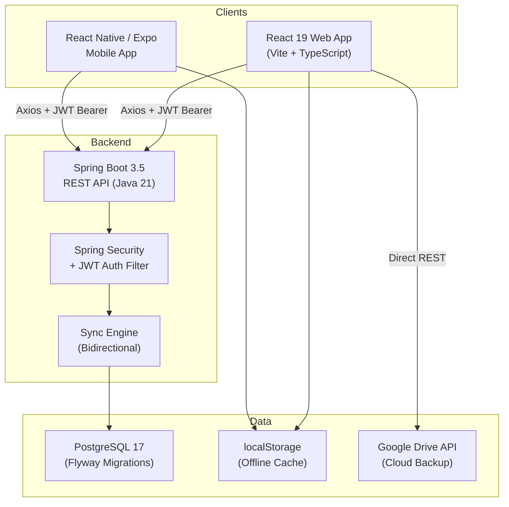
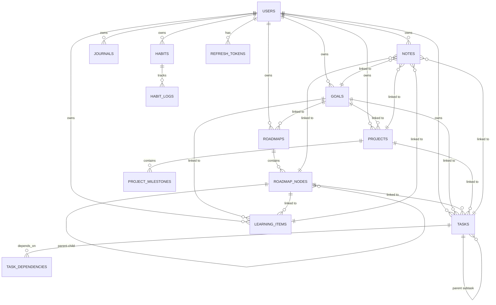

# LifeOS — Complete Technical Deep-Dive

> **A privacy-first, offline-first personal life management platform spanning web, mobile, and a robust API backend.**

---

## 1. High-Level Architecture



### Three-Tier Pattern
| Tier | Technology | Location |
|------|-----------|----------|
| **Frontend Web** | React 19 + Vite + TypeScript | [frontend/](file:///d:/projects/lifeos/frontend) |
| **Mobile App** | React Native 0.74 + Expo 51 | [mobile/](file:///d:/projects/lifeos/mobile) |
| **Backend API** | Spring Boot 3.5.14 + Java 21 | [backend/](file:///d:/projects/lifeos/backend) |
| **Database** | PostgreSQL 17 (Docker) | [docker-compose.yml](file:///d:/projects/lifeos/infrastructure/docker-compose.yml) |

---

## 2. Technology Stack — Full Breakdown

### 2.1 Backend ([pom.xml](file:///d:/projects/lifeos/backend/pom.xml))

| Dependency | Version | Purpose |
|-----------|---------|---------|
| **Java** | 21 | Language runtime (LTS) |
| **Spring Boot** | 3.5.14 | Application framework |
| **Spring Data JPA** | (managed) | ORM / Repository layer |
| **Spring Security** | (managed) | Auth & authorization chain |
| **Spring Validation** | (managed) | DTO `@Valid` annotations |
| **PostgreSQL Driver** | runtime | JDBC connectivity |
| **Flyway Core** + `flyway-database-postgresql` | (managed) | Schema version control |
| **JJWT (jjwt-api/impl/jackson)** | 0.12.6 | JWT token generation/validation |
| **Google API Client** | 2.7.2 | Google ID Token verification |
| **Google OAuth Client** | 1.39.0 | OAuth2 integration |
| **Lombok** | (managed) | Boilerplate reduction (`@Getter`, `@Setter`, `@RequiredArgsConstructor`) |
| **Maven Surefire** | 3.5.5 | Test execution (UTC timezone) |

### 2.2 Frontend Web ([package.json](file:///d:/projects/lifeos/frontend/package.json))

| Dependency | Version | Purpose |
|-----------|---------|---------|
| **React** | 19.2.6 | UI framework |
| **React DOM** | 19.2.6 | DOM rendering |
| **React Router DOM** | 7.17.0 | Client-side routing |
| **Axios** | 1.17.0 | HTTP client with interceptors |
| **@react-oauth/google** | 0.13.5 | Google Sign-In & Drive OAuth |
| **@tanstack/react-query** | 5.101.0 | Server state management |
| **react-hook-form** | 7.78.0 | Form handling |
| **Vite** | 8.0.12 | Build tool & dev server |
| **TypeScript** | 6.0.2 | Type safety |
| **ESLint** | 10.3.0 | Code linting |

### 2.3 Mobile App ([mobile/package.json](file:///d:/projects/lifeos/mobile/package.json))

| Dependency | Purpose |
|-----------|---------|
| **React Native** 0.74 | Cross-platform mobile |
| **Expo** 51 | Dev tooling & EAS builds |
| **React Navigation** | Tab-based routing |
| **AsyncStorage** | Local offline persistence |
| **Axios** | API communication |
| **react-native-svg** | SVG icon rendering |

### 2.4 Infrastructure

| Tool | Purpose |
|------|---------|
| **Docker** (PostgreSQL 17 container) | Local database environment |
| **Vercel** | Frontend hosting (SPA rewrite config) |
| **Render** | Backend hosting (planned) |
| **Git / GitHub** | Version control |

---

## 3. Database Design — Entity Relationship Model

### 3.1 Flyway Migrations

The schema evolves through 4 versioned migrations in [db/migration/](file:///d:/projects/lifeos/backend/src/main/resources/db/migration):

| Migration | What it creates |
|-----------|----------------|
| [V1__initial_schema.sql](file:///d:/projects/lifeos/backend/src/main/resources/db/migration/V1__initial_schema.sql) | Initial placeholder |
| [V2__create_users_table.sql](file:///d:/projects/lifeos/backend/src/main/resources/db/migration/V2__create_users_table.sql) | `users` table |
| [V3__create_refresh_tokens_table.sql](file:///d:/projects/lifeos/backend/src/main/resources/db/migration/V3__create_refresh_tokens_table.sql) | `refresh_tokens` table |
| [V4__create_lifeos_core_schema.sql](file:///d:/projects/lifeos/backend/src/main/resources/db/migration/V4__create_lifeos_core_schema.sql) | All 11 domain tables |

### 3.2 Complete Schema (V4)



### 3.3 All Tables (13 Total)

| # | Table | PK | Key Design Decisions |
|---|-------|----|---------------------|
| 1 | `users` | `UUID` | email unique, auth_provider (LOCAL/GOOGLE), BCrypt password hash |
| 2 | `refresh_tokens` | `UUID` | FK→users, revocable, expiry timestamp |
| 3 | `goals` | `UUID` | priority (LOW/MEDIUM/HIGH), status (NOT_STARTED/IN_PROGRESS/COMPLETED), life_area, motivation |
| 4 | `roadmaps` | `UUID` | FK→goals, is_template, is_public (future sharing) |
| 5 | `roadmap_nodes` | `UUID` | FK→roadmaps, self-referential parent_node_id, order_index, progress % |
| 6 | `projects` | `UUID` | FK→goals, status (PLANNING/IN_PROGRESS/COMPLETED/ON_HOLD) |
| 7 | `project_milestones` | `UUID` | FK→projects, is_completed boolean, due_date |
| 8 | `learning_items` | `UUID` | FK→goals + roadmap_nodes, type (COURSE/BOOK/CERTIFICATION/TOPIC/RESOURCE), lesson tracking |
| 9 | `tasks` | `UUID` | FK→goals + projects + roadmap_nodes, priority, status, recurring flag, parent subtask, estimated/actual time |
| 10 | `task_dependencies` | composite PK | Many-to-many self-join for task dependency chains |
| 11 | `notes` | `UUID` | Polymorphic FK to goals/tasks/projects/roadmap_nodes/learning_items, category |
| 12 | `journals` | `UUID` | One per user per day (UNIQUE constraint), mood, energy, wins, challenges, gratitude, lessons |
| 13 | `habits` | `UUID` | frequency (DAILY/WEEKLY), streak counter |
| 14 | `habit_logs` | `UUID` | FK→habits, completed_date, UNIQUE per habit per day |

> [!IMPORTANT]
> **All primary keys are UUIDs** — generated via `gen_random_uuid()` in PostgreSQL and `crypto.randomUUID()` on the client. This enables offline-first creation of entities without server round-trips, and eliminates ID collision across devices.

---

## 4. Security & Authentication System

### 4.1 Spring Security Filter Chain ([SecurityConfig.java](file:///d:/projects/lifeos/backend/src/main/java/com/lifeos/backend/config/SecurityConfig.java))

```
HTTP Request
    │
    ▼
┌─────────────────────────────────────┐
│  CORS Filter                        │
│  Allowed: localhost:5173,            │
│           *.vercel.app               │
└──────────────┬──────────────────────┘
               │
               ▼
┌─────────────────────────────────────┐
│  JWT Authentication Filter          │
│  (OncePerRequestFilter)             │
│  Extracts Bearer token → validates  │
│  → sets SecurityContext             │
└──────────────┬──────────────────────┘
               │
               ▼
┌─────────────────────────────────────┐
│  Authorization Rules                │
│  Public: /auth/*, /health, /error   │
│  All other requests: authenticated  │
└─────────────────────────────────────┘
```

**Public (unauthenticated) endpoints:**
- `POST /api/v1/auth/register`
- `POST /api/v1/auth/login`
- `POST /api/v1/auth/refresh`
- `POST /api/v1/auth/logout`
- `POST /api/v1/auth/google`
- `GET /api/v1/health`

### 4.2 JWT Token System ([JwtService.java](file:///d:/projects/lifeos/backend/src/main/java/com/lifeos/backend/security/JwtService.java))

| Token Type | Expiry | Storage |
|-----------|--------|---------|
| **Access Token** | 15 minutes (900,000 ms) | `localStorage` on client |
| **Refresh Token** | 7 days (604,800,000 ms) | `localStorage` + `refresh_tokens` DB table |

- **Signing**: HMAC-SHA with configurable secret key (`${JWT_SECRET}`)
- **Subject claim**: User's email address
- **Refresh tokens** are stored in database with `is_revoked` flag and `expires_at` timestamp
- On logout, the refresh token is revoked server-side

### 4.3 Google OAuth ([GoogleTokenService.java](file:///d:/projects/lifeos/backend/src/main/java/com/lifeos/backend/security/GoogleTokenService.java))

1. Frontend uses `@react-oauth/google` to obtain a Google ID token
2. Backend verifies the ID token using `GoogleIdTokenVerifier` with the app's `GOOGLE_CLIENT_ID`
3. If the user doesn't exist, auto-registers with `AuthProvider.GOOGLE`
4. Returns standard JWT access + refresh tokens for the LifeOS session

### 4.4 Auth API Endpoints ([AuthController.java](file:///d:/projects/lifeos/backend/src/main/java/com/lifeos/backend/auth/AuthController.java))

| Endpoint | Method | Request Body | Response |
|----------|--------|-------------|----------|
| `/auth/register` | POST | `{email, password, firstName, lastName?}` | `UserResponse` |
| `/auth/login` | POST | `{email, password}` | `{accessToken, refreshToken}` |
| `/auth/refresh` | POST | `{refreshToken}` | `{accessToken}` |
| `/auth/logout` | POST | `{refreshToken}` | void (revokes token) |
| `/auth/google` | POST | `{idToken}` | `{accessToken, refreshToken}` |

### 4.5 Frontend Token Management ([axios.ts](file:///d:/projects/lifeos/frontend/src/api/axios.ts))

- **Request interceptor**: Automatically injects `Authorization: Bearer <token>` on every request
- **Response interceptor (401 handler)**: On 401 → attempts refresh using a *clean axios instance* (avoids infinite loops) → retries original request → on failure, clears tokens and redirects to `/login`
- **Offline fallback**: Auth API calls ([authApi.ts](file:///d:/projects/lifeos/frontend/src/api/authApi.ts)) catch backend failures and fall back to `local-offline-access-token` placeholders, allowing the app to work entirely offline

### 4.6 Route Protection ([ProtectedRoute.tsx](file:///d:/projects/lifeos/frontend/src/routes/ProtectedRoute.tsx))

Simple token-presence guard: if no access token exists in localStorage, redirects to `/login`.

---

## 5. The Sync Engine — Core Innovation

### 5.1 Backend Sync Service ([SyncService.java](file:///d:/projects/lifeos/backend/src/main/java/com/lifeos/backend/sync/SyncService.java) — 726 lines)

The single `POST /api/v1/sync` endpoint handles **bidirectional synchronization** of all 11 entity types in a single transaction:

```
Client sends: SyncRequest {
    lastSyncTime,
    goals[], roadmaps[], roadmapNodes[],
    tasks[], projects[], projectMilestones[],
    learningItems[], notes[], journals[],
    habits[], habitLogs[]
}

Server processes:
  1. For each entity type, for each item:
     - If exists in DB AND client.updatedAt > server.updatedAt → UPDATE
     - If does not exist → INSERT
  2. Resolve task dependency relationships
  3. Recalculate all progress scores
  4. Query all entities updated after lastSyncTime
  5. Return merged results

Server returns: SyncResponse {
    syncTime,
    goals[], roadmaps[], roadmapNodes[],
    tasks[], projects[], projectMilestones[],
    learningItems[], notes[], journals[],
    habits[], habitLogs[]
}
```

**Conflict Resolution**: Last-writer-wins based on `updatedAt` timestamps.

### 5.2 Automatic Progress Recalculation

After every sync, `recalculateProgressForUser()` runs:

1. **Roadmap Node Progress**: Counts completed vs total tasks linked to each node → updates `progress` and `status`
2. **Goal Progress**: Composite of roadmap progress + direct tasks + project milestones
3. **Habit Streaks**: Iterates through sorted habit logs, counting consecutive completed days from today/yesterday backward

### 5.3 Frontend Sync Hook ([useLifeOsSync.ts](file:///d:/projects/lifeos/frontend/src/hooks/useLifeOsSync.ts) — 626 lines)

This is the **central state manager** for the entire frontend. It manages:

- **12 entity state arrays** (goals, roadmaps, roadmapNodes, tasks, projects, projectMilestones, learningItems, notes, journals, habits, habitLogs, horizonGoals)
- **localStorage persistence** — all data is saved locally on every mutation
- **CRUD operations** for every entity type (saveGoal, saveTask, saveNote, etc.)
- **Delete operations** with cascading cleanup (e.g., deleting a roadmap removes its nodes)
- **UUID generation** via `crypto.randomUUID()` for offline entity creation
- **Automatic timestamps** — `createdAt` and `updatedAt` set on every save

### 5.4 Google Drive Cloud Sync

The frontend implements a **direct Google Drive backup system** (no backend intermediary):

1. **Connect**: Uses `@react-oauth/google`'s `useGoogleLogin` with `drive.file` scope
2. **Search**: Looks for `lifeos_backup.json` on user's Drive
3. **Download & Merge**: If found, downloads and merges with local data using `mergeLists()`:
   - Items are keyed by UUID
   - Conflicts resolved by comparing `updatedAt` timestamps
4. **Upload**: Writes the merged dataset back to Drive via `PATCH` upload
5. **Token Management**: Stores access token + 1-hour expiry in localStorage

### 5.5 Manual JSON Backup

- **Export**: Serializes all local data to a downloadable `lifeos_backup.json` file
- **Import**: Reads a JSON file, merges with existing data using the same `mergeLists()` strategy, persists to localStorage, and reloads the page

---

## 6. Feature Modules — Detailed Breakdown

### 6.1 Goals System

**Entity**: [Goal.java](file:///d:/projects/lifeos/backend/src/main/java/com/lifeos/backend/goal/Goal.java)

| Field | Type | Purpose |
|-------|------|---------|
| title | String | Goal name |
| description | Text | Detailed description |
| priority | Enum: LOW/MEDIUM/HIGH | Importance level |
| status | Enum: NOT_STARTED/IN_PROGRESS/COMPLETED | Auto-computed from progress |
| progressPercentage | int | 0-100, auto-calculated |
| targetDate | DateTime | Target completion |
| lifeArea | String | Category (Career, Health, Finance, etc.) |
| motivation | Text | Why this goal matters |

**Progress Calculation** ([calculators.ts](file:///d:/projects/lifeos/frontend/src/utils/calculators.ts)):
- If goal has linked roadmaps → average progress across all roadmap root nodes (recursive tree calculation)
- If no roadmaps but has direct tasks → (completed tasks / total tasks) × 100
- Falls back to manually set progressPercentage

### 6.2 Roadmaps — Visual Learning Paths

**Entities**: `Roadmap` + `RoadmapNode` (self-referential tree)

- Roadmaps can be linked to goals or standalone
- Nodes form a **hierarchical tree** (parent_node_id self-reference)
- Each node tracks: title, description, resources, status, order, deadline, progress
- `is_template` and `is_public` flags prepare for future sharing/marketplace features
- **Recursive progress**: Node progress = average of child node progresses, or task completion ratio for leaf nodes

### 6.3 Tasks — Priority-Based Task Management

**Entity fields**: goalId, projectId, roadmapNodeId (polymorphic linking), priority, status (TODO/IN_PROGRESS/DONE/BACKLOG), recurring flag, recurrence pattern, parent subtask, estimated/actual time, life area, dependency IDs

Key features:
- **Task Dependencies**: Many-to-many self-join via `task_dependencies` table
- **Subtasks**: Parent-child hierarchy via `parent_task_id`
- **Time Tracking**: Estimated vs actual time fields
- **Recurring Tasks**: Flag + pattern string (e.g., "DAILY", "WEEKLY")
- **Cross-linking**: A single task can be linked to a goal, project, AND roadmap node simultaneously

### 6.4 Projects & Milestones

- Projects link to goals and have status lifecycle: PLANNING → IN_PROGRESS → COMPLETED / ON_HOLD
- Milestones are boolean checkpoints within projects
- Project progress = (completed milestones / total milestones) × 100

### 6.5 Learning Items

Types: COURSE, BOOK, CERTIFICATION, TOPIC, RESOURCE

- Track total lessons/pages vs completed
- Link to goals and/or roadmap nodes
- Progress percentage tracked independently

### 6.6 Notes — Polymorphic Notebook

- Can be linked to ANY entity: goal, task, project, roadmap node, or learning item
- Organized by **custom categories**
- Searchable through titles and content
- Unlinked notes default to "Unclassified" category

### 6.7 Journal — Daily Reflections

Structured daily entries with:
- **Wins**: What went well
- **Challenges**: What was hard
- **Lessons Learned**: Key takeaways
- **Gratitude**: Things to be thankful for
- **Mood**: 1-5 scale
- **Energy Level**: 1-5 scale
- **UNIQUE constraint**: One journal entry per user per day

### 6.8 Habits & Habit Logs

- Habits have a frequency (DAILY/WEEKLY) and running streak counter
- Habit logs record completion per day (UNIQUE per habit per day)
- **Streak calculation** ([calculators.ts L105-138](file:///d:/projects/lifeos/frontend/src/utils/calculators.ts#L105-L138)): Counts consecutive days backward from today/yesterday, breaks on first gap

### 6.9 Horizon Goals (Time-Based Targets)

- Break long-term goals into WEEKLY, MONTHLY, YEARLY targets
- Each has a simple TODO/DONE status
- Can optionally link to a parent goal

---

## 7. Analytics Engine

### 7.1 Dashboard Data ([calculators.ts L141-276](file:///d:/projects/lifeos/frontend/src/utils/calculators.ts#L141-L276))

Computed entirely client-side from local data:

| Metric | Calculation |
|--------|-------------|
| **Today's Tasks** | Tasks with dueDate ≤ today AND status ≠ DONE |
| **Completed Today** | Tasks with status = DONE AND updatedAt starts with today's date |
| **Active Goals** | Goals with computed status ≠ COMPLETED |
| **Average Goal Progress** | Mean of all goal progress percentages |
| **Habit Completion Rate** | (habits completed today / total habits) × 100 |
| **Journal Streak** | Consecutive days with journal entries from today backward |
| **Active Projects** | Projects with status ≠ COMPLETED |
| **Upcoming Deadlines** | Tasks, projects, roadmap nodes due within next 7 days |

### 7.2 Growth Score Algorithm ([calculators.ts L279-433](file:///d:/projects/lifeos/frontend/src/utils/calculators.ts#L279-L433))

A **composite weighted score** calculated over a 7-day rolling window:

```
Growth Score = (Habit Score × 0.40)
             + (Task Score × 0.25)
             + (Journal Score × 0.15)
             + (Learning Score × 0.20)
```

| Component (Weight) | Calculation |
|--------------------|-------------|
| **Habit Score (40%)** | (actual habit completions in window / possible completions) × 100 |
| **Task Score (25%)** | (tasks completed in window / tasks due in window) × 100; if no tasks due, 70 for any completion, 0 otherwise |
| **Journal Score (15%)** | (journal entries in window / 7) × 100, capped at 100 |
| **Learning Score (20%)** | Average progress % across all learning items |

### 7.3 Goal Completion Estimation

For each active goal:
- Count completed tasks in last 14 days → derive tasks/day velocity
- Estimate days remaining = remaining tasks / velocity
- Default: 0.1 tasks/day if no recent completions

### 7.4 Growth Trends

6-week historical chart: calculates the Growth Score for each of the last 6 weeks (7-day windows), creating a trend line.

### 7.5 Reflection Insights

Auto-generated text insights based on:
- Current growth score
- Habit completion rate (>80% = "Excellent", otherwise suggestion to improve)
- Journal frequency (≥5/week = "High reflection rate")
- Average mood score across all journals

---

## 8. Frontend Architecture

### 8.1 Routing ([App.tsx](file:///d:/projects/lifeos/frontend/src/App.tsx))

```
/login     → LoginPage (public)
/register  → RegisterPage (public)
/          → ProtectedRoute → DashboardPage (authenticated)
```

The entire authenticated experience lives in [DashboardPage.tsx](file:///d:/projects/lifeos/frontend/src/pages/DashboardPage.tsx) (683 lines), which renders a **sidebar + main content** layout with tab-based navigation.

### 8.2 Tab-Based Navigation (9 Tabs)

| Tab ID | Label | Component | Size |
|--------|-------|-----------|------|
| `dashboard` | Dashboard | [DashboardTab.tsx](file:///d:/projects/lifeos/frontend/src/components/DashboardTab.tsx) | 22KB |
| `goals` | Goals | [GoalsTab.tsx](file:///d:/projects/lifeos/frontend/src/components/GoalsTab.tsx) | 12KB |
| `roadmaps` | Roadmaps | [RoadmapsTab.tsx](file:///d:/projects/lifeos/frontend/src/components/RoadmapsTab.tsx) | 18KB |
| `tasks` | Tasks | [TasksTab.tsx](file:///d:/projects/lifeos/frontend/src/components/TasksTab.tsx) | 18KB |
| `notes` | Notes Notebook | [NotesTab.tsx](file:///d:/projects/lifeos/frontend/src/components/NotesTab.tsx) | 14KB |
| `journal` | Daily Reflections | [JournalTab.tsx](file:///d:/projects/lifeos/frontend/src/components/JournalTab.tsx) | 11KB |
| `habits` | Habit Tracker | [HabitsTab.tsx](file:///d:/projects/lifeos/frontend/src/components/HabitsTab.tsx) | 8KB |
| `learning` | Horizon Goals | [HorizonGoalsTab.tsx](file:///d:/projects/lifeos/frontend/src/components/HorizonGoalsTab.tsx) | 10KB |
| `analytics` | Analytics Engine | [AnalyticsTab.tsx](file:///d:/projects/lifeos/frontend/src/components/AnalyticsTab.tsx) | 16KB |

**Goal Workspace**: [GoalWorkspace.tsx](file:///d:/projects/lifeos/frontend/src/components/GoalWorkspace.tsx) (77KB) — the largest component, providing a dedicated workspace per goal with inline roadmap editing, task management, and notes.

### 8.3 Design System ([index.css](file:///d:/projects/lifeos/frontend/src/index.css) — 855 lines)

**Typography**: Google Fonts — `Plus Jakarta Sans` (body) + `Outfit` (display headings)

**Theme System**: CSS custom properties with dark/light mode toggle:

| Property | Light | Dark |
|----------|-------|------|
| `--bg` | `#f5f5f7` | `#000000` |
| `--surface` | `#ffffff` | `#1c1c1e` |
| `--text` | `#1d1d1f` | `#f5f5f7` |

**6 Accent Color Palettes** (user-selectable):
| Accent | Primary Color | CSS Class |
|--------|--------------|-----------|
| Slate | `#475569` | `.accent-slate` |
| Indigo | `#4f46e5` | `.accent-indigo` |
| Emerald | `#10b981` | `.accent-emerald` |
| Amber | `#f59e0b` | `.accent-amber` |
| Ruby | `#e11d48` | `.accent-ruby` |
| Violet | `#8b5cf6` | `.accent-violet` |

**Design Features**:
- Glassmorphism effects (`backdrop-filter: blur(12px)`)
- Smooth cubic-bezier transitions
- Multi-layer shadows (sm/md/lg)
- Apple-inspired neutral aesthetic

### 8.4 Interactive Help Tour

A 7-step guided tour built into [DashboardPage.tsx](file:///d:/projects/lifeos/frontend/src/pages/DashboardPage.tsx#L112-L141):
1. Welcome + offline-first overview
2. Priority-driven dashboard
3. Goals & workspaces
4. Time horizon goals
5. Categorized notes
6. Daily reflections
7. Analytics engine

Each step auto-navigates to the relevant tab.

---

## 9. Mobile App Architecture

### 9.1 Structure ([App.tsx](file:///d:/projects/lifeos/mobile/App.tsx))

- **Bottom Tab Navigator** with 4 screens: Dashboard, Goals, Tasks, Settings
- **Dark theme** matching web (background `#090d16`, accent `#a855f7`)
- **SVG icons** using `react-native-svg`
- Shares the same `useMobileSync` hook pattern as web
- API communication via same Axios + JWT setup

### 9.2 Screens

| Screen | File |
|--------|------|
| Dashboard | [DashboardScreen.tsx](file:///d:/projects/lifeos/mobile/src/screens/DashboardScreen.tsx) |
| Goals | [GoalsScreen.tsx](file:///d:/projects/lifeos/mobile/src/screens/GoalsScreen.tsx) |
| Tasks | [TasksScreen.tsx](file:///d:/projects/lifeos/mobile/src/screens/TasksScreen.tsx) |
| Settings | [SettingsScreen.tsx](file:///d:/projects/lifeos/mobile/src/screens/SettingsScreen.tsx) |

---

## 10. Backend Module Map

All modules live under `com.lifeos.backend` ([source root](file:///d:/projects/lifeos/backend/src/main/java/com/lifeos/backend)):

| Module | Files | Responsibility |
|--------|-------|---------------|
| `common/` | [BaseEntity.java](file:///d:/projects/lifeos/backend/src/main/java/com/lifeos/backend/common/BaseEntity.java) | `@MappedSuperclass` with `createdAt`/`updatedAt` + JPA lifecycle hooks |
| `user/` | User.java, UserRepository, DTOs, UserService | User entity + CRUD + auth logic |
| `security/` | [JwtService](file:///d:/projects/lifeos/backend/src/main/java/com/lifeos/backend/security/JwtService.java), [JwtAuthenticationFilter](file:///d:/projects/lifeos/backend/src/main/java/com/lifeos/backend/security/JwtAuthenticationFilter.java), [GoogleTokenService](file:///d:/projects/lifeos/backend/src/main/java/com/lifeos/backend/security/GoogleTokenService.java), RefreshToken | Token generation/validation/filter |
| `config/` | [SecurityConfig](file:///d:/projects/lifeos/backend/src/main/java/com/lifeos/backend/config/SecurityConfig.java), SecurityBeansConfig | Security chain + CORS + bean wiring |
| `auth/` | [AuthController](file:///d:/projects/lifeos/backend/src/main/java/com/lifeos/backend/auth/AuthController.java) | REST endpoints for auth flows |
| `sync/` | [SyncController](file:///d:/projects/lifeos/backend/src/main/java/com/lifeos/backend/sync/SyncController.java), [SyncService](file:///d:/projects/lifeos/backend/src/main/java/com/lifeos/backend/sync/SyncService.java), DTOs | Bidirectional sync engine (726 lines) |
| `goal/` | Goal, GoalPriority, GoalStatus, GoalRepository | Goal domain |
| `roadmap/` | Roadmap, RoadmapNode, RoadmapNodeStatus, repositories | Roadmap tree domain |
| `project/` | Project, ProjectMilestone, repositories | Project domain |
| `task/` | Task, TaskStatus, TaskPriority, TaskRepository | Task domain |
| `learning/` | LearningItem, LearningType, LearningStatus, repository | Learning domain |
| `note/` | Note, NoteRepository | Notes domain |
| `journal/` | Journal, JournalRepository | Journal domain |
| `habit/` | Habit, HabitLog, HabitFrequency, repositories | Habits domain |
| `dashboard/` | Dashboard API | Dashboard data endpoints |
| `analytics/` | Analytics API | Analytics computation endpoints |
| `health/` | Health endpoint | `GET /api/v1/health` |
| `exception/` | Global exception handling | Standardized error responses |

---

## 11. Configuration & Environment

### 11.1 Backend Config ([application.yaml](file:///d:/projects/lifeos/backend/src/main/resources/application.yaml))

```yaml
server.port: ${PORT:8081}
spring.datasource: ${DB_URL}, ${DB_USERNAME}, ${DB_PASSWORD}
spring.jpa.hibernate.ddl-auto: validate  # Flyway manages schema
spring.flyway.enabled: true
jwt.secret: ${JWT_SECRET}
jwt.access-token-expiration: 900000     # 15 minutes
jwt.refresh-token-expiration: 604800000 # 7 days
google.client-id: ${GOOGLE_CLIENT_ID}
```

### 11.2 Docker Compose ([docker-compose.yml](file:///d:/projects/lifeos/infrastructure/docker-compose.yml))

```yaml
PostgreSQL 17 container:
  - DB: lifeos
  - User: lifeos_user
  - Port: 5432
  - Persistent volume: postgres_data
```

### 11.3 Dockerfile ([Dockerfile](file:///d:/projects/lifeos/backend/Dockerfile))

Multi-stage build: `eclipse-temurin:21-jdk` → Maven package → Java JAR execution on port 8081.

### 11.4 Vercel Config ([vercel.json](file:///d:/projects/lifeos/frontend/vercel.json))

SPA rewrite: all routes → `/index.html` (required for React Router client-side routing).

---

## 12. Key Architectural Decisions

| Decision | Choice | Rationale |
|----------|--------|-----------|
| **IDs** | UUIDs everywhere | Offline creation, distributed systems, no enumeration attacks |
| **Schema Management** | Flyway (not Hibernate auto-DDL) | Version-controlled, safe deployments, rollback capability |
| **Sync Strategy** | Single endpoint, last-writer-wins | Simplicity; timestamp-based conflict resolution |
| **State Management** | Custom React hook (not Redux) | Self-contained, no external dependency, localStorage integration |
| **Offline-First** | localStorage primary, server secondary | Privacy, instant operations, no network dependency |
| **Cloud Backup** | Google Drive (user's own account) | Privacy — data stays in user's Google account, not third-party servers |
| **Dev Workflow** | Database → Backend → Tests → Frontend | Frontend consumes stable, tested APIs |

---

## 13. Current Status & Roadmap

### Completed (V1) ✅
- Authentication (Local + Google OAuth)
- Goals with auto-progress calculation
- Projects & Milestones
- Tasks (priority, subtasks, dependencies, recurring)
- Roadmaps (hierarchical node trees)
- Learning Items
- Notes (polymorphic linking, categories)
- Journal (structured daily reflections)
- Habits & Streak Tracking
- Horizon Goals (Weekly/Monthly/Yearly)
- Dashboard with real-time metrics
- Analytics Engine with Growth Score
- Google Drive Cloud Backup
- Manual JSON Export/Import
- Dark/Light theme + 6 accent colors
- Interactive Help Tour
- Mobile App (Dashboard, Goals, Tasks, Settings)

### Pending (V1) ⏳
- Reminders
- Full-text Search
- Tags system
- Calendar view

### Future (Phase 2-3)
- AI Roadmap Generation
- Roadmap Sharing/Marketplace
- End-to-End Encryption
- Team Workspaces & Collaboration
- Real-time Sync (WebSockets)
- Mobile Push Notifications

---

## 14. API Reference Summary

| Endpoint | Method | Auth | Purpose |
|----------|--------|------|---------|
| `/api/v1/health` | GET | ❌ | Health check |
| `/api/v1/auth/register` | POST | ❌ | Create account |
| `/api/v1/auth/login` | POST | ❌ | Login → JWT tokens |
| `/api/v1/auth/refresh` | POST | ❌ | Refresh access token |
| `/api/v1/auth/logout` | POST | ❌ | Revoke refresh token |
| `/api/v1/auth/google` | POST | ❌ | Google OAuth → JWT tokens |
| `/api/v1/sync` | POST | ✅ | Bidirectional full data sync |
| `/api/v1/dashboard` | GET | ✅ | Dashboard metrics |
| `/api/v1/analytics` | GET | ✅ | Analytics data |
| `/api/v1/users/me` | GET | ✅ | Current user profile |

---

## 15. Codebase Statistics

| Layer | Files | Total Size | Primary Language |
|-------|-------|-----------|-----------------|
| Backend Java | ~50+ | ~50KB source | Java 21 |
| Backend SQL | 4 migrations | ~7KB | SQL |
| Frontend Components | 10 tabs | ~208KB | TypeScript/React |
| Frontend Infra | 8 files | ~25KB | TypeScript |
| Frontend CSS | 1 file | 18KB | CSS |
| Mobile | ~10 files | ~15KB | TypeScript/RN |
| **Total** | **~80+ source files** | **~325KB** | **Multi-language** |

> The largest single file is [GoalWorkspace.tsx](file:///d:/projects/lifeos/frontend/src/components/GoalWorkspace.tsx) at 77KB — a full-featured workspace component with inline editing for roadmaps, tasks, notes, and habits within a single goal context.
